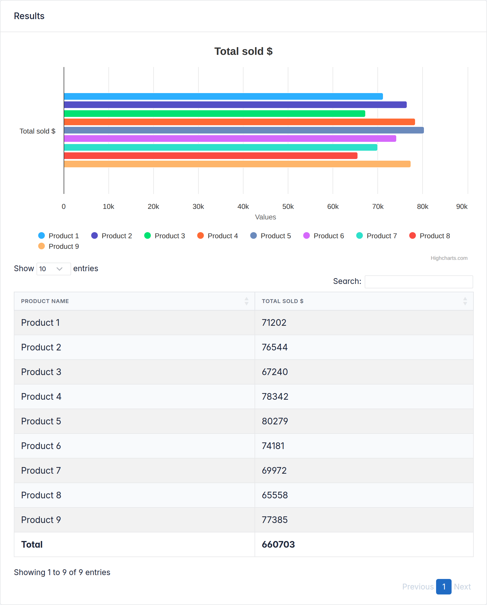
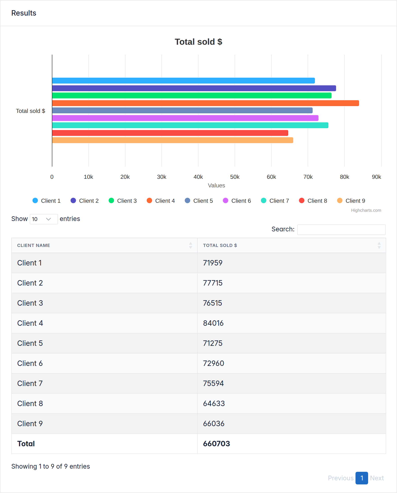
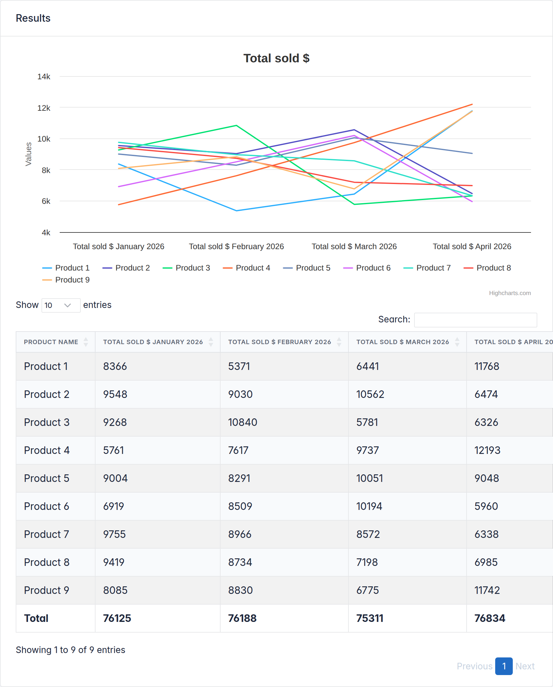
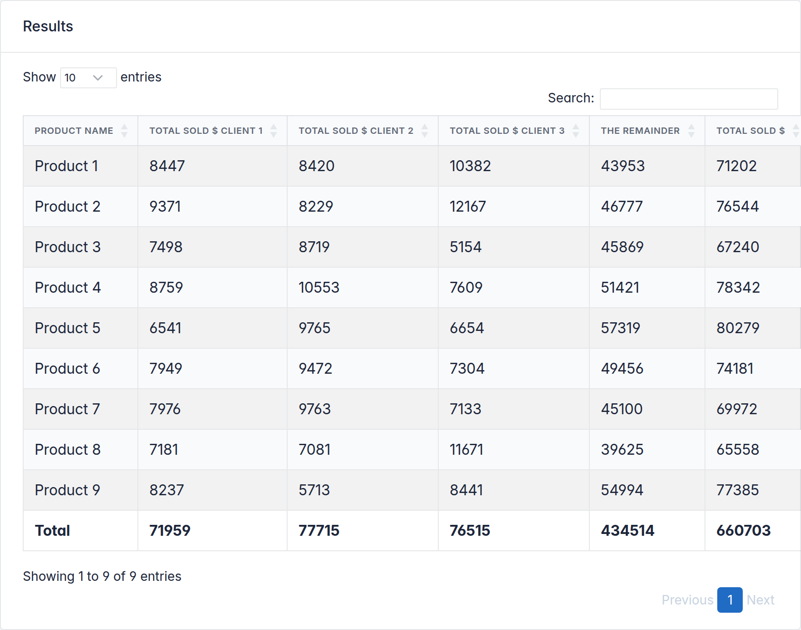

<div align="center">

# Django Slick Reporting

### The one-stop reporting engine for Django — every report is one small declarative class.

[](https://pypi.org/project/django-slick-reporting)
[](https://github.com/ra-systems/django-slick-reporting/actions/workflows/django.yml)
[](https://pypi.org/project/django-slick-reporting)
[](https://pypi.org/project/django-slick-reporting)
[](https://github.com/ra-systems/django-slick-reporting/blob/develop/LICENSE.md)
[](https://django-slick-reporting.readthedocs.io/)

Grouped totals, time series, crosstabs and charts — declared once, generated for you.
Change one line of the class, get a totally different report.

```console
pip install django-slick-reporting
```

[**Live Demo**](https://django-slick-reporting.com/) · [**Documentation**](https://django-slick-reporting.readthedocs.io/) · [**Quickstart**](#quickstart)

</div>

---

## The shape of a report

A report is a small declarative class: every attribute maps to a visible part of the output.
Watch what happens below as we change **one line at a time** — same `SalesTransaction` model throughout.

### A group-by report

<table>
<tr>
<td width="50%" valign="top">

```python
# views.py
from django.db.models import Sum
from slick_reporting.views import ReportView, Chart
from slick_reporting.fields import ComputationField
from .models import SalesTransaction


class ProductSales(ReportView):
    report_model = SalesTransaction
    date_field = "date"
    group_by = "product"

    columns = [
        "name",
        ComputationField.create(
            Sum, "value",
            name="value__sum",
            verbose_name="Total sold $",
        ),
    ]

    chart_settings = [
        Chart(
            "Total sold $", Chart.BAR,
            data_source=["value__sum"],
            title_source=["name"],
        ),
    ]
```

```python
# urls.py
path("product-sales/", ProductSales.as_view()),
```

</td>
<td width="50%" valign="top">



Filter form, chart, sortable table and CSV export — all generated from the class.

</td>
</tr>
</table>

### Change one line → a different report

`group_by` accepts any field or relation path. Swap `"product"` for `"client"`:

<table>
<tr>
<td width="50%" valign="top">

```python
class ClientSales(ReportView):
    report_model = SalesTransaction
    date_field = "date"
    group_by = "client"   # ← the only change

    columns = [
        "name",
        ComputationField.create(
            Sum, "value",
            name="value__sum",
            verbose_name="Total sold $",
        ),
    ]

    chart_settings = [
        Chart(
            "Total sold $", Chart.BAR,
            data_source=["value__sum"],
            title_source=["name"],
        ),
    ]
```

</td>
<td width="50%" valign="top">



Same class, new grouping — a completely different report.

</td>
</tr>
</table>

### Add two lines → a monthly time series

<table>
<tr>
<td width="50%" valign="top">

```python
class MonthlyProductSales(ReportView):
    report_model = SalesTransaction
    date_field = "date"
    group_by = "product"
    columns = ["name"]

    time_series_pattern = "monthly"  # ← new
    time_series_columns = [          # ← new
        ComputationField.create(
            Sum, "value",
            name="value__sum",
            verbose_name="Total sold $",
        ),
    ]

    chart_settings = [
        Chart(
            "Total sold $", Chart.LINE,
            data_source=["value__sum"],
            title_source=["name"],
        ),
    ]
```

`"monthly"` can be `"daily"`, `"weekly"`, `"yearly"` or a custom pattern.

</td>
<td width="50%" valign="top">



One column per month, computed per period.

</td>
</tr>
</table>

### Or pivot it → a crosstab matrix

<table>
<tr>
<td width="50%" valign="top">

```python
class ProductSalesCrosstab(ReportView):
    report_model = SalesTransaction
    date_field = "date"
    group_by = "product"

    crosstab_field = "client"
    crosstab_columns = [
        ComputationField.create(
            Sum, "value",
            name="value__sum",
            verbose_name="Total sold $",
        ),
    ]

    columns = [
        "name",
        "__crosstab__",
        ComputationField.create(
            Sum, "value",
            name="value__total",
            verbose_name="Total",
        ),
    ]
```

</td>
<td width="50%" valign="top">



Products as rows, clients as columns, totals at the intersections.

</td>
</tr>
</table>

More shapes — list views, custom querysets, precomputed crosstabs, time-series × crosstab combinations — in the [documentation](https://django-slick-reporting.readthedocs.io/en/latest/).

---

## Charts, from the same class

Declare the calculation **once**; switch the visualization by changing a single argument — no new query, no new template.

<div align="center">

</div>

### Any chart engine

Set `chart_engine` on the report (or per `Chart`). The same data renders through your engine of choice:

<table>
<tr>
<td width="33%" align="center"><b>Highcharts</b><br><code>chart_engine="highcharts"</code></td>
<td width="33%" align="center"><b>Chart.js</b><br><code>chart_engine="chartsjs"</code></td>
<td width="33%" align="center"><b>ApexCharts</b><br><code>chart_engine="apexcharts"</code></td>
</tr>
<tr>
<td width="33%"></td>
<td width="33%"></td>
<td width="33%"></td>
</tr>
</table>

Any other JS charting library can be plugged in as a [custom engine](https://django-slick-reporting.readthedocs.io/en/latest/topics/charts.html).

### Dashboards

Compose any report into a page as a self-contained widget — chart, table, or both — with one template tag:

```django




```

See the [live dashboard example](https://django-slick-reporting.com/dashboard/).

## Features

- **Every report shape** — simple aggregates, group-by, time-series, crosstab/pivot, and combinations of them.
- **Charts included** — Highcharts, Chart.js and ApexCharts wrappers, plus pluggable custom engines.
- **Custom calculations** — build reusable computation fields, chain dependencies, compute percentages and balances.
- **Dashboards** — drop any report onto a page as a self-contained widget with a template tag.
- **Ask-the-data assistant** — an optional LLM assistant answers plain-English questions with a generated report ([docs](https://django-slick-reporting.readthedocs.io/en/latest/topics/llm_assistant.html)).
- **Model-optional** — report against a Django model, a traversed relation, a raw SQL table, or precomputed/aggregated data.
- **Fast & extendable** — optimized queries, CSV export out of the box, and hooks for everything.

## Installation

```console
pip install django-slick-reporting
```

Add it to `INSTALLED_APPS` and you're ready:

```python
INSTALLED_APPS = [
    ...,
    "crispy_forms",
    "crispy_bootstrap5",
    "slick_reporting",
]
```

## Quickstart

The [group-by report](#a-group-by-report) above is a complete working example — declare the class, wire one URL, done.
Prefer data without a view? The same configuration works on the low-level engine:

```python
from slick_reporting.generator import ReportGenerator

report = ReportGenerator(
    report_model=SalesTransaction,
    group_by="product",
    columns=["name", "__total__"],
)
report.get_report_data()
# -> [{'name': 'Product 1', '__total__': 56}, {'name': 'Product 2', '__total__': 43}, ...]
```

## Demo site

Live at **[django-slick-reporting.com](https://django-slick-reporting.com/)**, or run it locally:

```console
git clone https://github.com/ra-systems/django-slick-reporting.git
python -m venv .venv && source .venv/bin/activate

cd django-slick-reporting/demo_proj
pip install -r requirements.txt
python manage.py migrate
python manage.py create_entries   # generates demo data
python manage.py runserver
```

## Documentation

Full documentation lives on [Read the Docs](https://django-slick-reporting.readthedocs.io/en/latest/). Build it locally with:

```console
cd docs
pip install -r requirements.txt
sphinx-build -b html source build
```

## Running the tests

```console
git clone git@github.com:ra-systems/django-slick-reporting.git
cd django-slick-reporting/tests
python -m pip install -e ..
python runtests.py
# coverage:
coverage run --include=../* runtests.py && coverage html
```

## Contributing

PRs and reviews are most welcome. We follow
[Django's contributing guidelines](https://docs.djangoproject.com/en/dev/internals/contributing/writing-code/unit-tests/).
If the project is useful to you, please consider giving it a star — it keeps the project visible and motivated.

## Authors

- **Ramez Ashraf** — *Initial work* — [@RamezIssac](https://github.com/RamezIssac)

## You might also like

- [**Django ERP Framework**](https://github.com/ra-systems/RA) — build business solutions with ease.
- [**Django Tabular Permissions**](https://github.com/RamezIssac/django-tabular-permissions) — Django permissions in a translatable, filterable HTML table.
