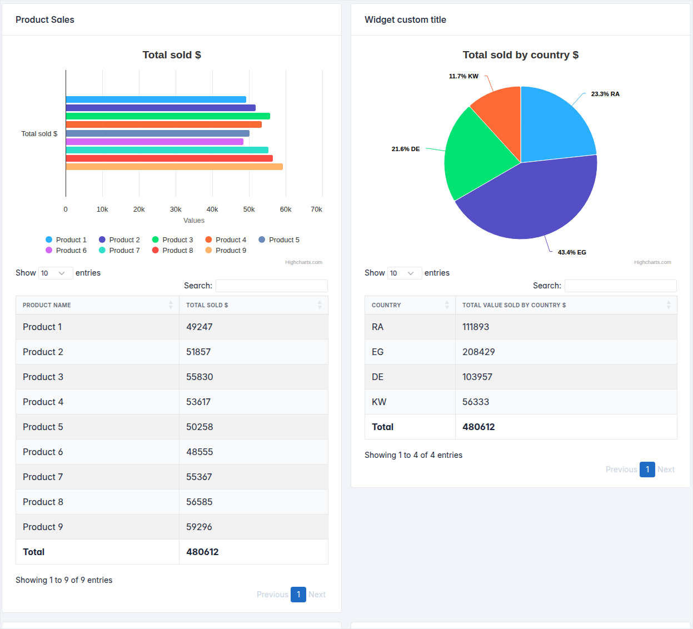

Django Slick Reporting
=======================

**The one-stop reporting engine for Django** — analytics, charts & dashboards in a few lines of code.

.. raw:: html

   

   
   
   
   
   
   

Grouped totals, time-series, crosstabs and pivots — each one a small Python class, each one chartable with a single line, in **Highcharts, Chart.js or ApexCharts**.

----

Why Django Slick Reporting?
----------------------------

.. grid:: 1 2 2 3
   :gutter: 3
   :class-container: sd-mb-4

   .. grid-item-card:: Every report shape
      :class-card: sd-border-1

      Simple aggregates, group-by, time-series, crosstab/pivot, and any combination of them, in a handful of lines.

   .. grid-item-card:: Charts included
      :class-card: sd-border-1

      :doc:`Highcharts, Chart.js and ApexCharts <topics/charts>` wrappers — bar, column, line, area, pie, stacked or totalled.

   .. grid-item-card:: Custom calculations
      :class-card: sd-border-1

      Build reusable :ref:`computation fields <computation_field>`, chain dependencies, compute percentages and balances.

   .. grid-item-card:: Dashboards
      :class-card: sd-border-1

      Drop any report onto a page as a self-contained :ref:`widget <widgets>` with a single template tag.

   .. grid-item-card:: Model-optional
      :class-card: sd-border-1

      Report against a Django model, a traversed relation, a raw SQL table, or precomputed/aggregated data.

   .. grid-item-card:: Fast & extendable
      :class-card: sd-border-1

      Optimized queries, CSV export out of the box, and hooks for everything.

Installation
------------

To install django-slick-reporting with pip

.. code-block:: bash

    pip install django-slick-reporting

Usage
-----

#. Add ``"slick_reporting", "crispy_forms", "crispy_bootstrap4",`` to ``INSTALLED_APPS``.
#. Add ``CRISPY_TEMPLATE_PACK = "bootstrap4"`` to your ``settings.py``
#. Execute ``python manage.py collectstatic`` so the JS helpers are collected and served.

Quickstart
----------

You can start by using ``ReportView`` which is a subclass of ``django.views.generic.FormView``

.. code-block:: python

    # in views.py
    from slick_reporting.views import ReportView, Chart
    from slick_reporting.fields import ComputationField
    from .models import MySalesItems
    from django.db.models import Sum

    class ProductSales(ReportView):

        report_model = MySalesItems
        date_field = "date_placed"
        group_by = "product"

        columns = [
            "title",
            ComputationField.create(
                method=Sum, field="value", name="value__sum", verbose_name="Total sold $"
            ),
        ]

        # Charts
        chart_settings = [
            Chart(
                "Total sold $",
                Chart.BAR,
                data_source=["value__sum"],
                title_source=["title"],
            ),
        ]

    # in urls.py
    from django.urls import path
    from .views import ProductSales

    urlpatterns = [
        path("product-sales/", ProductSales.as_view(), name="product-sales"),
    ]

That's the whole report — filter form, chart, sortable data table and CSV export are generated for you.

Demo site
----------

`django-slick-reporting.com <https://django-slick-reporting.com>`_ is a quick walk-though with live code examples.

Where to next?
---------------

.. grid:: 1 2 2 4
   :gutter: 3
   :class-container: sd-mb-4

   .. grid-item-card:: :ref:`Concept <structure>`

      What Django Slick Reporting is and how its pieces fit together.

   .. grid-item-card:: :ref:`Tutorial <tutorial>`

      Build group-by, time-series and crosstab reports step by step.

   .. grid-item-card:: :ref:`Topics <topics>`

      Deep dives — options, forms, charts, exporting, widgets.

   .. grid-item-card:: :ref:`Reference <reference>`

      API reference for views, fields, generator and settings.

.. toctree::
   :maxdepth: 2
   :caption: Contents:
   :hidden:

   concept
   tutorial
   topics/index
   ref/index

Indices and tables
==================

* :ref:`genindex`
* :ref:`modindex`
* :ref:`search`
