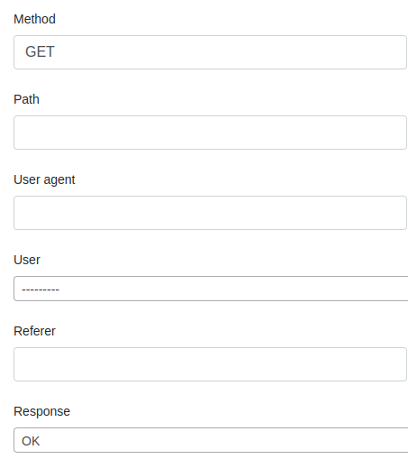

SlickReportingListView
======================

This is a simple ListView to display data in a model, like you would with an admin ChangeList view.
It's quite similar to ReportView except there is no calculation, by default.

Options:
--------

filters: a list of report_model fields to be used as filters.

.. code-block:: python

    class RequestLog(ListReportView):
        report_model = Request

        filters = ["method", "path", "user_agent", "user", "referer", "response"]

Would yield a form like this

Check :ref:`filter_form_customization` To customize the form as you wish.
