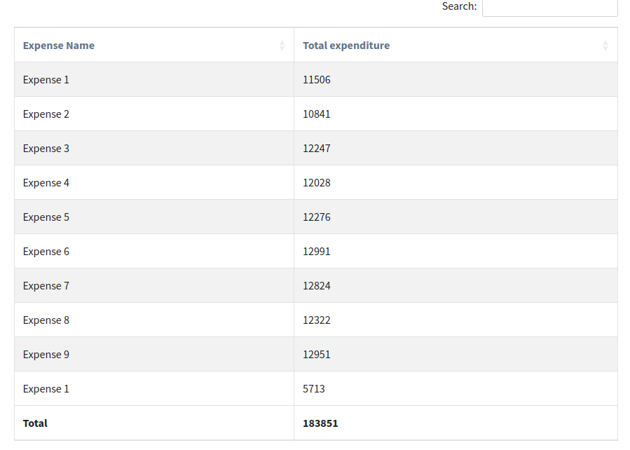

================
Group By Reports
================

General use case
----------------

Group by reports are reports that group the data by a specific field, while doing some kind of calculation on the grouped fields. For example, a report that groups the expenses by the expense type.

Example:

.. code-block:: python

    class ExpenseTotal(ReportView):
        report_model = ExpenseTransaction
        report_title = _("Expenses Daily")
        group_by = "expense"

        columns = [
            "name", # name field on the expense model
            SlickReportField.create(Sum, "value", verbose_name=_("Total Expenditure"), name="value"),
        ]

A Sample group by report would look like this:

In the columns you can access to fields on the model that is being grouped by, in this case the Expense model, and the computation fields.

Group by a traversing field
---------------------------

``group_by`` value can be a traversing field. If set, the report will be grouped by the last field in the traversing path,
    and, the columns available will be those of the last model in the traversing path.

Example:

.. code-block:: python

    class ExpenseTotal(ReportView):
        report_model = ExpenseTransaction
        report_title = _("Expenses Daily")
        group_by = "expense__expensecategory" # Note the traversing

        columns = [
            "name", # name field on the ExpenseCategory model
            SlickReportField.create(Sum, "value", verbose_name=_("Value"), name="value"),
        ]

Group by custom querysets
-------------------------

Grouping can also be over a curated queryset(s).

Example:

.. code-block:: python

        class MyReport(ReportView):
        report_model = MySales

        group_by_querysets = [
            MySales.objects.filter(status="pending"),
            MySales.objects.filter(status__in=["paid", "overdue"]),
        ]
        group_by_custom_querysets_column_verbose_name = _("Status")

        columns = [
            "__index__",
            SlickReportField.create(Sum, "value", verbose_name=_("Value"), name="value"),
        ]

This report will create two groups, one for pending sales and another for paid and overdue together.

The ``__index__`` column is a "magic" column, it will added automatically to the report if it's not added.
It just hold the index of the row in the group.
its verbose name (ie the one on the table header) can be customized via ``group_by_custom_querysets_column_verbose_name``

You can then customize the *value* of the __index__ column via ``filter_results`` hook
