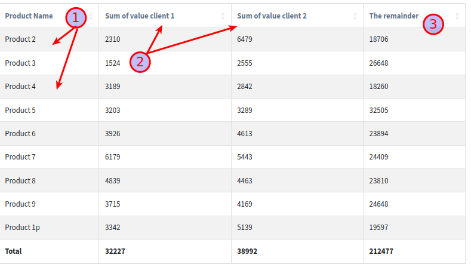

.. _crosstab_reports:

Crosstab Reports
=================
Use crosstab reports, also known as matrix reports, to show the relationships between three or more query items.
Crosstab reports show data in rows and columns with information summarized at the intersection points.

General use case
----------------
Here is a general use case:

.. code-block:: python

    from django.utils.translation import gettext_lazy as _
    from django.db.models import Sum
    from slick_reporting.views import ReportView

    class CrosstabReport(ReportView):
        report_title = _("Cross tab Report")
        report_model = SalesTransaction
        group_by = "client"
        date_field = "date"

        columns = [
            "name",
            "__crosstab__",
            # You can customize where the crosstab columns are displayed in relation to the other columns

            SlickReportField.create(Sum, "value", verbose_name=_("Total Value")),
            # This is the same as the calculation in the crosstab,
            # but this one will be on the whole set. IE total value.
        ]

        crosstab_field = "product"
        crosstab_columns = [
            SlickReportField.create(Sum, "value", verbose_name=_("Value")),
        ]

Crosstab on a Traversing Field
------------------------------
You can also crosstab on a traversing field. In the example below we extend the previous crosstab report to be on the product sizes

.. code-block:: python

        class CrosstabWithTraversingField(CrosstabReport):
            crosstab_field = "product__size"

Customizing the crosstab ids
----------------------------
You can set the default ids that you want to crosstab on, so the initial report, ie without user setting anything, comes out with the values you want

.. code-block:: python

        class CrosstabWithIds(CrosstabReport):
            def get_crosstab_ids(self):
                return [Product.objects.first().pk, Product.objects.last().pk]

Customizing the Crosstab Filter
-------------------------------

For more fine tuned report, You can customize the crosstab report by supplying a list of tuples to the ``crosstab_ids_custom_filters`` attribute.
The tuple should have 2 items, the first is a list of Q object(s) -if any- , and the second is a dict of kwargs filters . Both will be passed to the filter method of the ``report_model``.

Example:

.. code-block:: python

        class CrosstabWithIdsCustomFilter(CrosstabReport):
            crosstab_ids_custom_filters = [
                (~Q(product__size__in=["extra_big", "big"]), dict()),

                (None, dict(product__size__in=["extra_big", "big"])),
            ]
            # Note:
            # if crosstab_ids_custom_filters is set, these settings has NO EFFECT
            # crosstab_field = "client"
            # crosstab_ids = [1, 2]
            # crosstab_compute_remainder = True

Customizing the verbose name of the crosstab columns
----------------------------------------------------
Similar to what we did in customizing the verbose name of the computation field for the time series,
Here, We also can customize the verbose name of the crosstab columns by Subclass ``SlickReportField`` and setting the ``crosstab_field_verbose_name`` attribute on your custom class.
Default is that the verbose name will display the id of the crosstab field, and the remainder column will be called "The remainder".

Let's see two examples on how we can customize the verbose name.

Example 1: On a "regular" crosstab report

.. code-block:: python

        class CustomCrossTabTotalField(SlickReportField):
            calculation_field = "value"
            calculation_method = Sum
            verbose_name = _("Sales for")
            name = "sum__value"

            @classmethod
            def get_crosstab_field_verbose_name(cls, model, id):
                if id == "----":  # 4 dashes: the remainder column
                    return _("Rest of Products")

                name = Product.objects.get(pk=id).name
                return f"{cls.verbose_name} {name}"

        class CrossTabReportWithCustomVerboseName(CrosstabReport):
            crosstab_columns = [
                CustomCrossTabTotalField
            ]

Example 2: On the ``crosstab_ids_custom_filters`` one

.. code-block:: python

        class CustomCrossTabTotalField2(CustomCrossTabTotalField):

            @classmethod
            def get_crosstab_field_verbose_name(cls, model, id):
                if id == 0:
                    return f"{cls.verbose_name} Big and Extra Big"
                return f"{cls.verbose_name} all other sizes"

        class CrossTabReportWithCustomVerboseNameCustomFilter(CrosstabWithIdsCustomFilter):
            crosstab_columns = [
                CustomCrossTabTotalField2
            ]

Example
-------

1. The Group By. In this example, it is the product field.
2. The Crosstab. In this example, it is the client field. crosstab_ids were set to client 1 and client 2
3. The remainder. In this example, it is the rest of the clients. crosstab_compute_remainder was set to True
